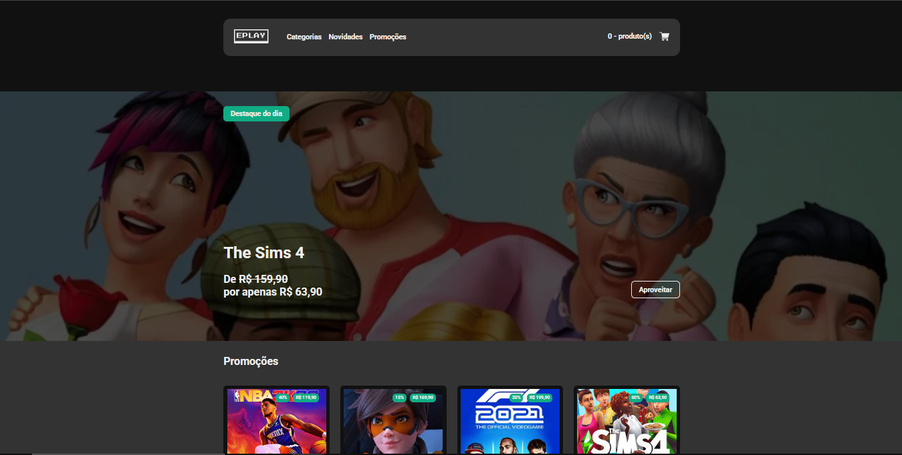

[JAVASCRIPT__BADGE]: https://img.shields.io/badge/Javascript-000?style=for-the-badge&logo=javascript
[TYPESCRIPT__BADGE]: https://img.shields.io/badge/typescript-D4FAFF?style=for-the-badge&logo=typescript
[REACT__BADGE]: https://img.shields.io/badge/React-005CFE?style=for-the-badge&logo=react
[PROJECT__BADGE]: https://img.shields.io/badge/📱Visit_this_project-000?style=for-the-badge&logo=project
[PROJECT__URL]: https://eplay-monosodrac.vercel.app/
[NODE_BADGE]:https://img.shields.io/badge/node.js-20.16.0-43853D?style=for-the-badge&logo=node.js

<h1 align="center" style="font-weight: bold;">Eplay 💻</h1>

![react][REACT__BADGE]
![typescript][TYPESCRIPT__BADGE]
![javascript][JAVASCRIPT__BADGE]
![node][NODE_BADGE]

<details open="open">
<summary>Table of Contents</summary>
 
- [📌 About](#about)
- [🚀 Getting started](#started)
  - [Prerequisites](#prerequisites)
  - [Cloning](#cloning)
  - [Starting](#starting)
- [📍 Application Routes](#routes)
- [🤝 How to reach me](#reach)
  
</details>


<p align="center">
    
</p>

<h2 id="about">📌 About</h2>

Eplay is web a game store, and this is the final project for frontend part of the Full-Stack Python course by [EBAC](https://ebaconline.com.br/full-stack-python)

[![project][PROJECT__BADGE]][PROJECT__URL]

<h2 id="started">🚀 Getting started</h2>

<h3>Prerequisites</h3>

- [NodeJS](https://nodejs.org/en/download)

<h3>Cloning</h3>

```bash
git clone https://github.com/monosodrac/eplay.git
```

<h3>Starting</h3>

```bash
cd eplay
npm install
npm start
```

<h2 id="routes">📍 Application Routes</h2>

| route               | description                                          
|----------------------|-----------------------------------------------------
| <kbd>/</kbd>     | page to Home
| <kbd>/categories</kbd>     | page to games listed by its category
| <kbd>/product/:id</kbd>     | page to detail product by its id

<h2 id="reach">🤝 How to reach me</h2>

<table>
  <tr>
    <td align="center">
      <a href="https://linktr.ee/monosodrac">
        <br>
        <sub>
          <b>Mono</b>
        </sub>
      </a>
    </td>
  </tr>
</table>
